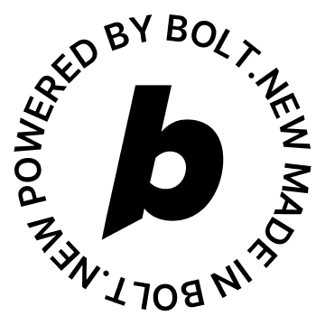

# MoneyTalk

<p align="left">
<a href="https://www.producthunt.com/products/moneytalk?embed=true&utm_source=badge-featured&utm_medium=badge&utm_source=badge-moneytalk" target="_blank"></a>
  <a href="https://bolt.new/">
    
  </a>
</p>

<a href="https://trakteer.id/randhipp" target="_blank"></a>

MoneyTalk is a voice-based personal finance tracker built with React Native (Expo). Users can track expenses and income by simply speaking or snapping a photo of a receipt. The app uses AI to extract the amount, categorize the transaction, and understand time references in both English and Indonesian.

## ✨ Features
- Voice input to record income/expenses
- Supports Bahasa Indonesia and English
- AI-powered parsing of amount, category, and time
- Smart detection: "yesterday", "3 days ago", etc.
- Receipt photo scanning (OCR) to detect total and category
- Lightweight local database (SQLite)
- Modern UI optimized for speed and clarity

## 🚧 Status
This project is currently in **BETA**.

## 📦 Tech Stack
- **React Native (Expo)**
- **OpenAI / Claude Sonnet 4** (for prompt-based AI parsing)
- **SQLite** (local data storage)
- **Expo Camera** (receipt scanning)
- **JavaScript/TypeScript**

## 🛠️ Getting Started
1. Clone the repo

```bash
git clone https://github.com/randhipp/moneytalk.git
cd moneytalk
```

2. Install dependencies
```bash
yarn install
```

3. Run the app
```bash
npx expo start
```

> Make sure you have Expo CLI installed and a connected device or emulator ready.

## 🧪 Example Voice Inputs
- "Beli kopi 20000 kemarin"
- "Received salary 5 million three days ago"
- "Top up Gopay 150000"

## 📸 Example Receipt Input
- Snap photo of a printed receipt
- AI detects total and assigns a category automatically

## 📄 Roadmap
- [x] Voice input
- [x] Natural language date parsing (ID + EN)
- [x] Receipt OCR (amount + category)
- [ ] Date parsing from receipts
- [ ] Budget goals
- [ ] iOS build & TestFlight
- [ ] Cloud sync + user accounts

## 🤝 Contributing
Pull requests are welcome! For major changes, please open an issue first to discuss what you would like to change.

## 📬 Contact
Made with love by [@randhipp](https://github.com/randhipp). Feel free to open an issue or reach out via LinkedIn.

---

**MoneyTalk** is built to make finance tracking as easy as talking. If you're tired of typing every transaction, give it a try!